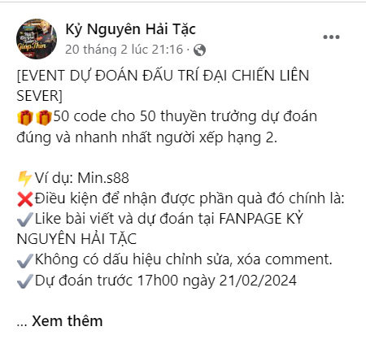
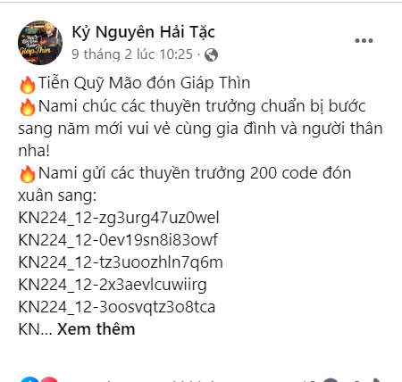
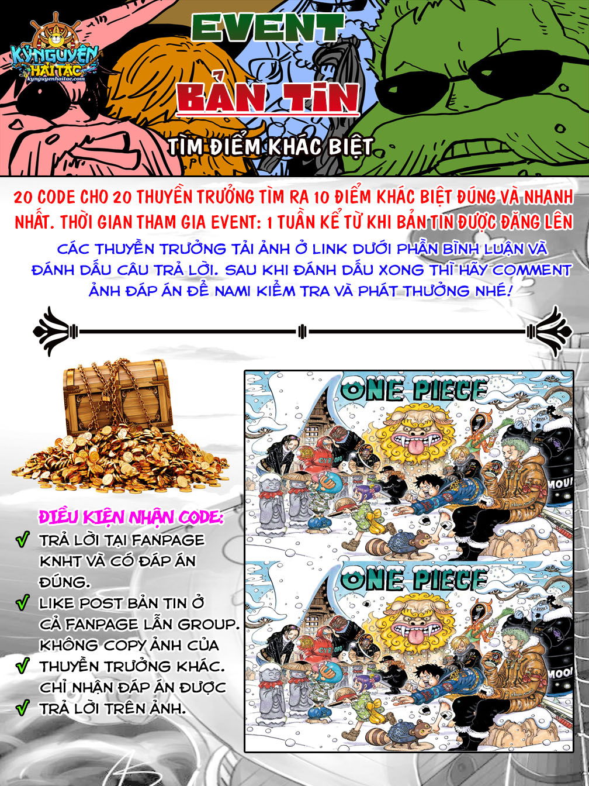
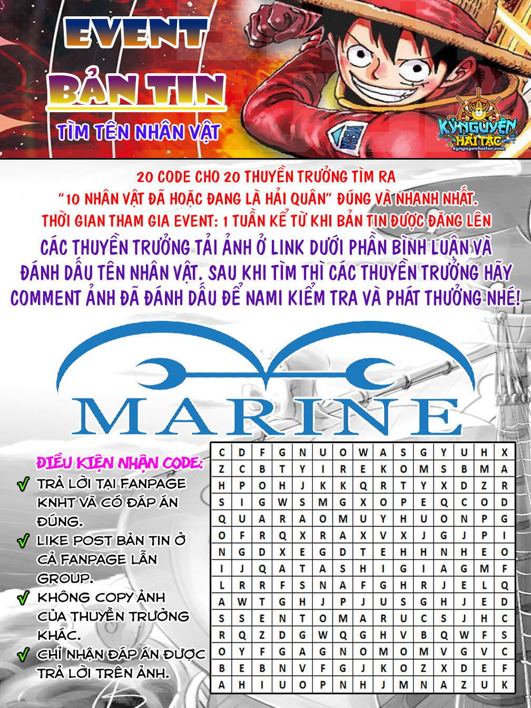
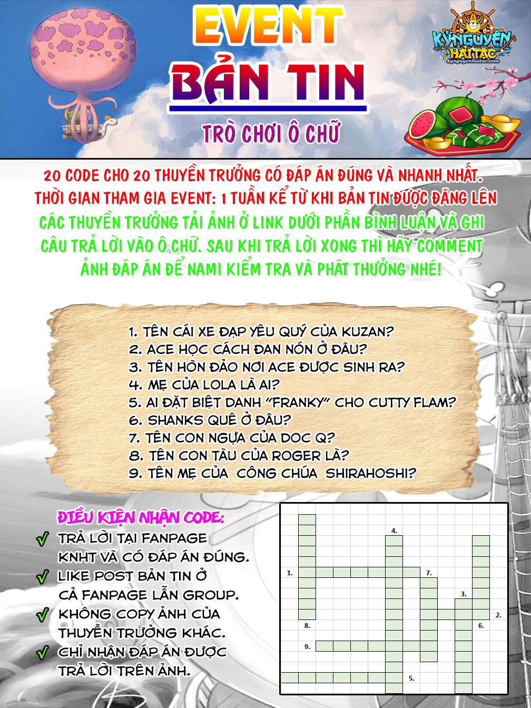

# Hướng Dẫn Nhận Và Nhập Code

*Ngày đăng: 03-05-2024*

## Các Loại Code Và Cách Nhận

### Code server mới

**Code:** TANTHU-KYNGUYENHAITAC

**Đối tượng:** Toàn server

**Phần thưởng:**

- Tặng Free Vip 12
- Tặng 100.000 Vàng
- Tặng 1 Tỷ Beri
- Tặng 3.000.000 Chiến Tích
- Tặng 100.000 Danh Vọng
- Tặng 2.000 Lực Hành Động

### Code dự đoán sự kiện giải đấu liên sever

**Thời gian:** Trong thời gian sự kiện các giải đấu liên server (Đấu trí, Vượt ải, Công hội chiến)

**Số lượng:** 50

**Điều kiện:**

- Like bài viết và dự đoán tại [FANPAGE KỶ NGUYÊN HẢI TẶC](https://www.facebook.com/kynguyenhaitac)
- Không có dấu hiệu chỉnh sửa, xóa comment.
- Dự đoán trước 23h59 ngày 13/02/2024 (Thời gian thay đổi theo từng sự kiện)

**Ví dụ:**

### Code sự kiện đặc biệt

**Thời gian:** Trong thời gian sự kiện đặc biệt: Tết Âm Lịch, 30/4-1/5, 2/9, Sinh nhật game, Giáng sinh

**Đối tượng:** Toàn sever

**Số lương:** Không giới hạn

### Code facebook

**Thời gian:** Trong thời gian sự kiện đặc biệt: Tết Âm Lịch, 30/4-1/5, 2/9, Sinh nhật game, Giáng sinh

**Địa điểm:** [Facebook Kỷ nguyên hải tặc](https://www.facebook.com/kynguyenhaitac)

**Số lương:** 200

### Code event bản tin

**Thời gian tham gia event:** 1 tuần kể từ khi bản tin được đăng lên

**Số lương:** 20

**Bao gồm các trò chơi:**

- Tìm điểm khác biệt
- Tìm tên nhân vật
- Trò chơi ô chữ

## Hướng Dẫn Nhập Code

- Mở nút **Lễ Bao** trên khung giao diện nhân vật.

.png)

- Copy mã code và click chuột phải => chọn paste vào khung **Lễ Bao**.

.png)

- Sau đó chọn **Nhận lễ bao** và vào mail nhận thưởng.

.png).
.png).

:::danger Lưu ý

- Các thuyền trưởng nên để trống rương để tránh tổn thất không đáng có.

:::

## Tham Khảo Nguồn

- [https://kynguyenhaitac.com/tin-tuc/huong-dan-nhap-code-47.html](https://kynguyenhaitac.com/tin-tuc/huong-dan-nhap-code-47.html)
